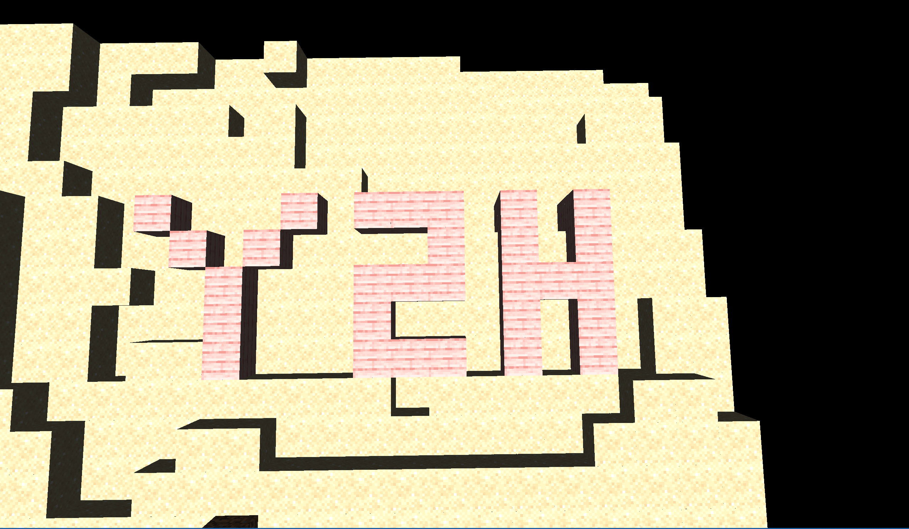
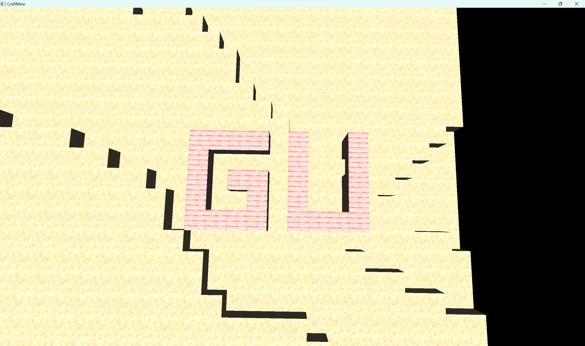

## 提醒：在经过一段时间的赶工期后，本仓库成功变成了屎山，不建议因为任何理由使用/查阅本仓库代码，除非你想要学习如何写出一坨屎山

## 预期实现效果

## TodoList
- [x] 时间刻
  - [x] 帧率计算
- [x] 游戏窗口
  - [x] 光照系统
  - [x] 地形生成
      - [x] 柏林噪音计算
      - [x] 天空盒
      - [x] 方块png蒙版
      - [x] 方块面渲染
  - [x] 十字光标
  - [x] 鼠标指针动态
  - [x] 键盘映射
- [ ] 方块
  - [x] 草方块
  - [x] 石头
  - [x] 泥土
  - [x] 原木
  - [x] 沙子
  - [x] 木板
    - [ ] ~~工作台及合成表功能(待定)~~
  - [x] 方块被破坏
  - [x] 方块渲染
- [ ] ~~实体~~
	- [ ] ~~玩家~~
      - [x] 活动
          - [x] 移动
          - [ ] ~~跳跃~~
          - [ ] ~~水下移动~~
          - [ ] ~~水下跳跃~~
          - [x] 飞行模式(待定)
          - [x] 破坏方块
            - [x] 计算指针指向方块
            - [ ] ~~播放破坏动画~~
          - [x] 放置方块
            - [x] 计算指针指向方块
      - [x] ~~背包~~
	- [ ] ~~怪物(待定)~~
	- [ ] ~~掉落物(待定)~~

## 如何运行
1. 克隆仓库到本地
2. 确保你的电脑上有Maven（IDEA自带）
3. 更新Maven依赖
4. 运行

如果提示在源根目录外，请将src设置为源代码根目录

## 已知 ~~BUG~~ 特性
 - 偶发的当放置方块过快导致方块卡住玩家时，有概率当前方块被挖掘后无法清除渲染
 - 由于时间原因，没有写边界检查，放置方块不能超出边界，否则程序抛异常退出
 - 由于计算精度问题，鼠标左键长按破坏方块时，会消耗比预设更久的时间
 - ESC释放鼠标时，会强制重置视角且视角移动不会停止
 - 视角转换没有万向锁，因此在某些情况下会出现视角翻转，这个时候，狂甩鼠标就能恢复正常
 - 偶发性的视角无法移动，是因为鼠标甩得太快了，导致鼠标指针超出窗口范围，解决方法是按下`Esc键`释放鼠标，然后再按下`Esc键`重置鼠标
 - 由于未知原因，玩家碰撞体积比设定的要大，无论碰撞箱如何设置。经实验，玩家通过至少需要2*2*2的空间
 - LWJGL深度测试与天空盒渲染有冲突 ，~~因此删除了天空盒~~
 - 为何有大片沙地？因为没时间写水

## 进行游戏
1. 按下`WASD`键移动
2. 按下`空格键`向正上方飞，按下`Shift键`向正下方飞
3. 鼠标左键长按破坏方块，鼠标右键单击放置方块
4. 按下`Esc键`释放鼠标
5. 在`src/com/craftmine/game/GameResources.java`中修改游戏参数
6. 点击数字键1~8切换放置方块类型

或许你可以在`src/com/craftmine/game/GameResources.java`中修改地图大小，挑战一下电脑软肋（bushi）

## 预计使用第三方库
[LWJGL](https://www.lwjgl.org/)：图形化界面以及各种相关库 
   - [openAL](https://www.openal.org/)：一个适用于游戏应用程序和许多其他类型音频应用程序的跨平台3D音频API。
   - [openGL](https://www.khronos.org/opengl/)：业内最广泛采用的 2D 和 3D 图形 API，为各种计算机平台带来了数千个应用程序。
   - [GLFW](https://www.glfw.org/)：创建多个窗口，处理用户输入（键盘、鼠标、游戏外设）并管理上下文。还支持多显示器、剪贴板访问、文件拖放，以及更多功能 。
   - [Assimp](https://www.assimp.org/)：一个可移植的开源库，用于以统一的方式导入各种常见的 3D 模型格式。
   - [STB](https://github.com/nothings/stb)
   - [ImGUI](https://github.com/ocornut/imgui)：可视化/调试工具

[JOML](https://joml-ci.github.io/JOML/)：一个用于 OpenGL 渲染计算的 Java 数学库

## 参考资料
[我的世界开发者中文指南](https://github.com/mouse0w0/MinecraftDeveloperGuide?tab=readme-ov-file) 
[只用7个命令方块做出柏林噪声生成地形？！](https://www.bilibili.com/video/BV1vfKJedEdA/) 
~~[How to Use Perlin Noise in Your Games](http://devmag.org.za/2009/04/25/perlin-noise/)~~ 全英文没看完 
~~[《3D Game Development with LWJGL 3》中文翻译](https://mouse0w0.github.io/lwjglbook-CN-Translation/02-the-game-loop/)~~ ~~过时的翻译~~先前版本的翻译 
[3D Game Development with LWJGL 3](https://ahbejarano.gitbook.io/lwjglgamedev)的[翻译](https://yin2hao.github.io/lwjglbook-CN-Translation/) 
[GLFW官方文档](https://www.glfw.org/docs/latest/) 
[OpenGL官方文档](https://www.khronos.org/opengl/wiki/Main_Page)

## 参考项目
部分功能实现参考了[MineCraftMini](https://github.com/wyndwarrior/MineCraftMini) 
整体实现参考了[3D Game Development with LWJGL 3](https://github.com/lwjglgamedev/lwjglbook)